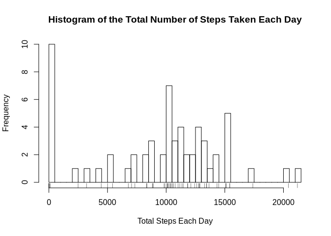
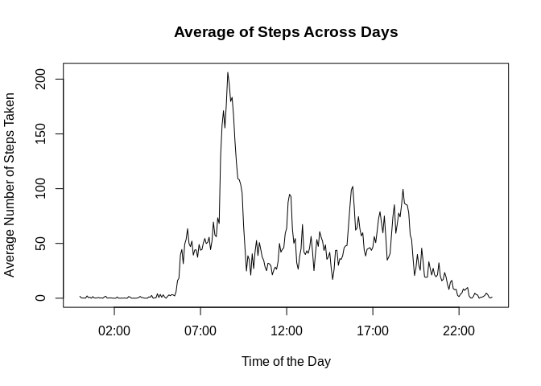
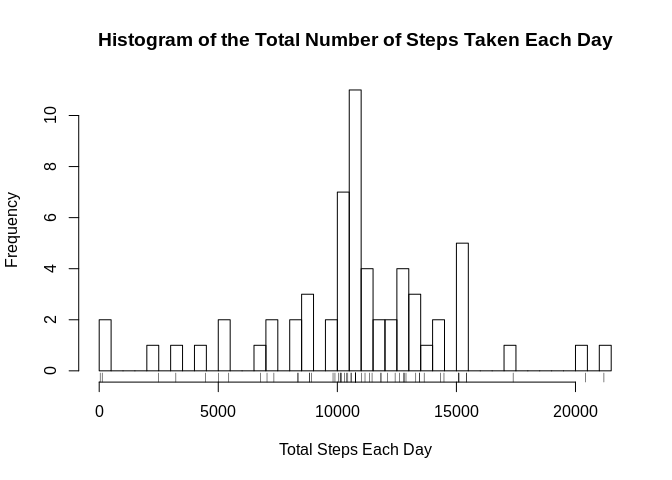
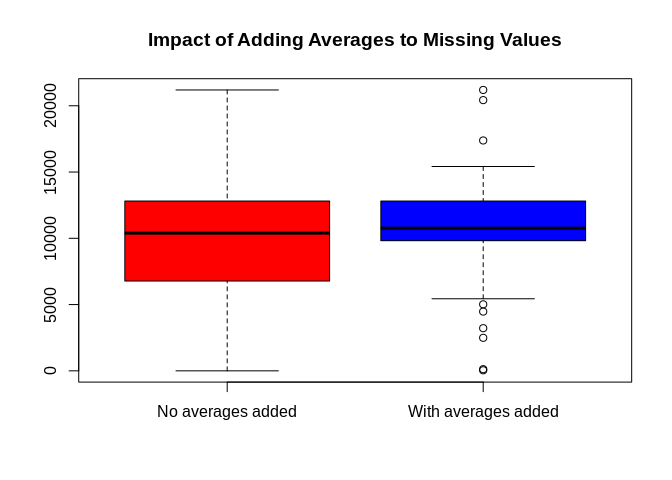
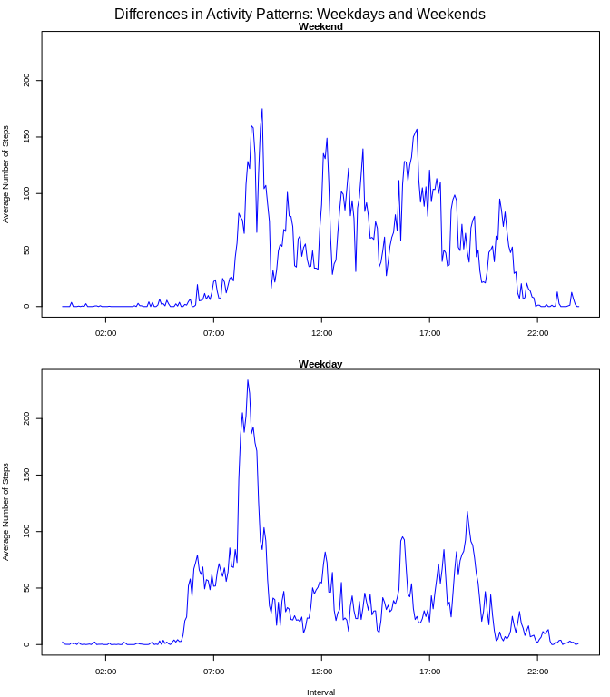

## Loading and preprocessing the data

```r
activity <- read.csv(unzip('activity.zip', files = 'activity.csv'), sep = ',')
activity$date <- as.Date(activity$date)
activity$time <- as.POSIXct(sprintf("1970-01-01 %02d:%02d", activity$interval%/%100, activity$interval%%100))
str(activity)
```

```
## 'data.frame':	17568 obs. of  4 variables:
##  $ steps   : int  NA NA NA NA NA NA NA NA NA NA ...
##  $ date    : Date, format: "2012-10-01" "2012-10-01" ...
##  $ interval: int  0 5 10 15 20 25 30 35 40 45 ...
##  $ time    : POSIXct, format: "1970-01-01 00:00:00" "1970-01-01 00:05:00" ...
```

## What is mean total number of steps taken per day?

```r
total_steps_per_day <- aggregate(activity$steps, by= list(activity$date), FUN=sum, na.rm = TRUE)
title <- "Histogram of the Total Number of Steps Taken Each Day"
xlab <- "Total Steps Each Day"
hist(total_steps_per_day$x, breaks = 50, main = title, xlab = xlab)
rug(total_steps_per_day$x)
```

<!-- -->

```r
avg_total_steps <- mean(total_steps_per_day$x)
median_total_steps <- median(total_steps_per_day$x)
```
- The mean total number of steps taken per day is avg_total_steps (9354.2295082), and the median is median_total_steps (10395).

## What is the average daily activity pattern?

```r
avg_daily_steps <- aggregate(activity$steps, by=list(activity$time), FUN=mean, na.rm=TRUE)
title <- "Average of Steps Across Days"
xlab <- "Time of the Day"
ylab <- "Average Number of Steps Taken"
plot(avg_daily_steps, type = "l", main = title, xlab = xlab, ylab = ylab)
```

<!-- -->

```r
max_time <- format(avg_daily_steps$Group.1[avg_daily_steps$x == max(avg_daily_steps$x)], "%H:%M")
```
- The 5-minute interval on average across all the days in the dataset that contains the maximum number of steps is max_time (08:35).

## Imputing missing values

```r
missing <- is.na(activity$steps)
total_missing_values <- sum(missing)
```
- The total number of missing values in the dataset is total_missing_values (2304).

### Getting indices for average at each interval

```r
avg_indices <- match(activity$time[missing],avg_daily_steps$Group.1)
```
### Making new dataset filled with average values to the missing ones

```r
new_activity <- data.frame(activity)
new_activity$steps[missing] <- avg_daily_steps$x[avg_indices]
```
### Histogram of the total number of steps taken each day

```r
new_total_steps_per_day <- aggregate(x = new_activity$steps, by=list(new_activity$date), FUN=sum)
title <- "Histogram of the Total Number of Steps Taken Each Day"
xlab <- "Total Steps Each Day"
hist(new_total_steps_per_day$x, breaks = 50, main = title, xlab = xlab)
rug(new_total_steps_per_day$x)
```

<!-- -->

```r
new_avg_total_steps <- mean(new_total_steps_per_day$x)
new_median_total_steps <- median(new_total_steps_per_day$x)
```

- The mean total number of steps taken per day is avg_total_steps (1.0766189\times 10^{4}), and the median is median_total_steps (1.0766189\times 10^{4}).

```r
boxplot(total_steps_per_day$x, new_total_steps_per_day$x, names = c("No averages added", "With averages added"), col = c("red", "blue"), main="Impact of Adding Averages to Missing Values")
```

<!-- -->

#### Do these values differ from the estimates from the first part of the assignment? What is the impact of imputing missing data on the estimates of the total daily number of steps?
- Yes, we can see that the mean and the median had a slight overall increase, and the deviation has decreased so that extreme values turn into outliers.

## Are there differences in activity patterns between weekdays and weekends?

```r
Sys.setlocale("LC_TIME", "en_US.UTF-8")
```

```
## [1] "en_US.UTF-8"
```

```r
weekend <- c('Saturday','Sunday')
wdays <- weekdays(activity$date)
activity$weekday <- factor((wdays %in% weekend),levels = c(TRUE,FALSE), labels = c('weekend','weekday'))

weekday_data <- activity[activity$weekday == 'weekday',]
weekend_data <- activity[activity$weekday == 'weekend',]

weekday_avg <- aggregate(weekday_data$steps, by=list(weekday_data$time),FUN=mean, na.rm=TRUE)
weekend_avg <- aggregate(weekend_data$steps, by=list(weekend_data$time),FUN=mean, na.rm=TRUE)

par(mfrow=c(2,1), mar=c(4,4,1,0), oma=c(0,0,2,1), cex=0.6)
yrange <- range(weekend_avg$x, weekday_avg$x)
ylab <- "Average Number of Steps"
plot(weekend_avg, type="l", main="Weekend", ylim = yrange, xlab = NA, ylab = ylab, col="blue")
plot(weekday_avg, type="l", main="Weekday", ylim = yrange, xlab = "Interval", ylab = ylab, col="blue")
mtext("Differences in Activity Patterns: Weekdays and Weekends", outer = TRUE)
```

<!-- -->
